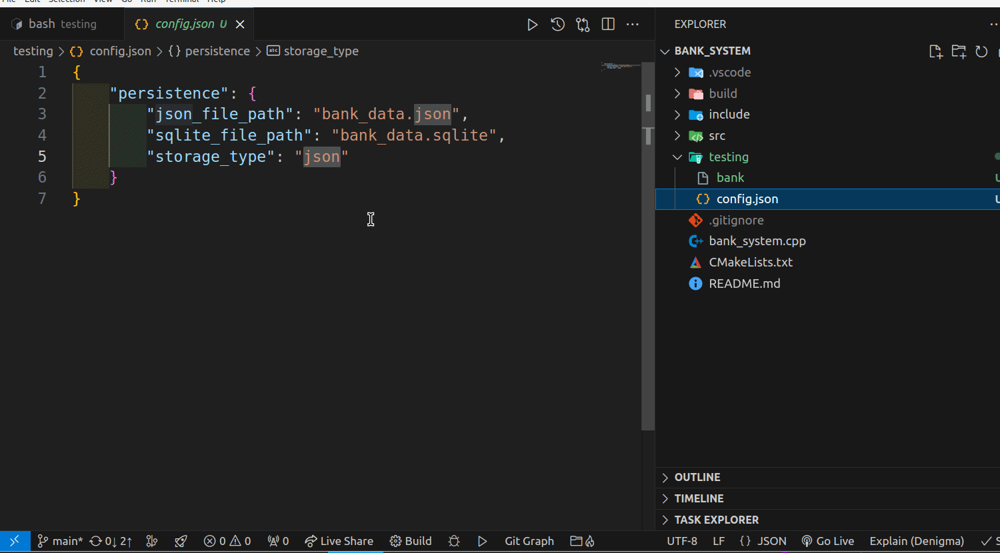
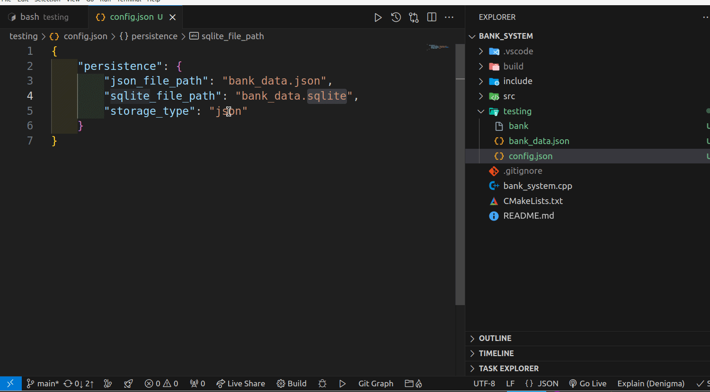

# 🏦 Universal Bank System

A robust C++ banking system with dual persistence support (SQLite3 and JSON) featuring account management and transaction operations.

[](https://isocpp.org/)
[](https://www.sqlite.org/)
[](https://github.com/nlohmann/json)

## 📋 Project Overview

The Universal Bank System is a command-line banking application that provides comprehensive account management capabilities. It features a flexible persistence layer that can store data either in SQLite3 database or JSON files, configurable through a simple configuration file.


## 🎞️ GIF Demo
- Demo for save data by using binary JSON file


- Demo for save data by using SQLite3 database

### 🔑 Key Features

- Account creation and management
- Balance inquiry and transaction operations
- Multiple storage backend support (SQLite/JSON)
- Detailed account history tracking
- Person-centric account viewing
- Configurable persistence layer

## 🛠️ System Requirements

- C++17 compatible compiler
- SQLite3 development libraries
- nlohmann/json library
- CMake 3.10 or higher

## 📦 Installation

1. **Clone the repository**
   ```bash
   git clone https://github.com/your-username/bank_system.git
   cd bank_system
   ```

2. **Install dependencies (Ubuntu/Debian)**
   ```bash
   sudo apt update
   sudo apt install build-essential cmake libsqlite3-dev
   ```

3. **Build the project**
   ```bash
   mkdir build && cd build
   cmake ..
   make
   ```

## ⚙️ Configuration

The system uses a `config.json` file to determine the storage backend:

```json
{
    "persistence": {
        "json_file_path": "bank_data.json",
        "sqlite_file_path": "bank_data.sqlite",
        "storage_type": "sqlite"
    }
}
```

- Set `storage_type` to either `"sqlite"` or `"json"` to choose the storage backend
- Configure file paths for both SQLite and JSON storage

## 🎯 Features & Usage

### Available Operations

1. **Create Account** (Option 1)
   - Create new bank account with initial deposit
   - Requires name and national ID
   
2. **Delete Account** (Option 2)
   - Remove existing account by ID

3. **Balance Inquiry** (Option 3)
   - Check account balance using account ID

4. **Show Person Accounts** (Option 4)
   - View all accounts owned by a specific person

5. **Show Account Details** (Option 5)
   - View comprehensive account information including:
     - Account owner
     - Last operation details
     - Account creation time
     - Transaction history

6. **Deposit** (Option 6)
   - Add funds to an account

7. **Withdrawal** (Option 7)
   - Remove funds from an account

### Example Usage

```bash
./bank
```

Sample interaction:
```
Welcome to Universal Bank System
Please enter the number for your choice:
1: Create Account
2: Delete Account
3: Balance Inquiry
4: Show Person Accounts
5: Show Account Details
6: Deposit
7: Withdrawal
8: Exit
```

## 🗄️ Data Persistence

The system supports two types of data storage:

1. **SQLite Storage**
   - Relational database storage
   - Transaction-safe operations
   - Efficient querying capabilities

2. **JSON Storage**
   - File-based storage
   - Human-readable format
   - Easy backup and transfer

## 🔒 Security Features

- National ID verification
- Transaction logging
- Operation timestamps
- Unique account IDs
- Data persistence verification

## 🐛 Error Handling

The system includes comprehensive error handling for:
- Invalid account operations
- Insufficient funds
- Database constraints
- Configuration issues
- Data loading/saving errors

## 📊 Project Structure

```
bank_system/
├── bank_system.cpp          # Main application entry
├── include/
│   ├── bank.h              # Bank operations
│   ├── cli.h               # Command line interface
│   ├── serialization.h     # JSON serialization
│   ├── config_manager.h    # Configuration handling
│   └── sqlite.h            # SQLite operations
└── src/
    └── [Implementation files]
```

## 🤝 Contributing

1. Fork the repository
2. Create your feature branch
3. Commit your changes
4. Push to the branch
5. Create a Pull Request

## 📝 License

This project is licensed under the MIT License - see the [LICENSE](LICENSE) file for details.

## 🔍 Future Enhancements

- [ ] Add Qt QML GUI Front-end
- [ ] Multi-currency support
- [ ] Interest calculation
- [ ] Account types (Savings, Current)
- [ ] Transaction categories
- [ ] Export statements
- [ ] User authentication

## 📞 Support

For support, please open an issue in the GitHub repository or contact the maintainers.